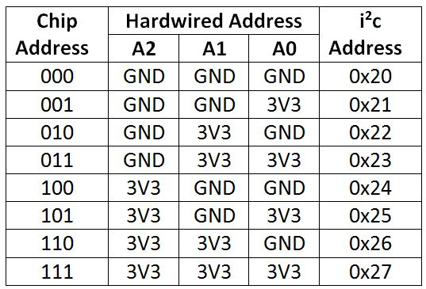
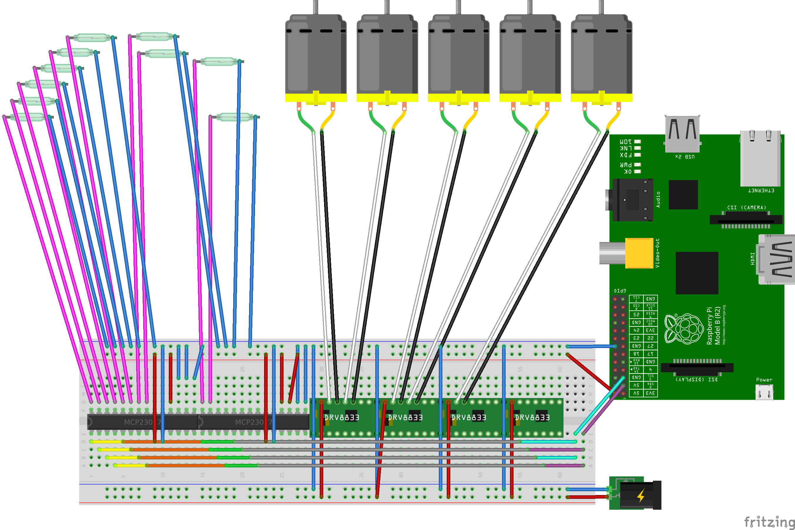

# Sensonation

### Description

Sensonation it is an open hardware/software project for home blinds automation.
It's using raspberry pi as management unit, electronics stuff and dc engines for moving up and down blinds.
Main goal of this project is to make opening and closing home blind as automated as it's possible.

### Software Architecture

Sensonation is a Java process run in [Raspbian](https://www.raspbian.org/). 
Software is build with [Spring framework](https://spring.io/) using elements such as:

- Spring Boot
- Spring MVC
 
Java process is run as web application server in embedded servlet container [Tomcat](http://tomcat.apache.org/). Communication with User is over [HTTP](https://en.wikipedia.org/wiki/Hypertext_Transfer_Protocol) API.

Blinds maagement is possible thanks of library [Pi4j](https://github.com/Pi4J/pi4j/). Communiction between Java process and hardware is over [I2C bus](https://en.wikipedia.org/wiki/I%C2%B2C)

Blinds movement automation is based on calculation daylaigth changes in manner of localisation by [SunCalc-Java](https://github.com/florianmski/SunCalc-Java).

### Hardware Architecture

From hardware perpective Sensonation works on [raspberry pi model b](https://www.raspberrypi.org/products/model-b/). Of course run on higher versionion is also possible.

DC engines are controlled by [DRV8833 Dual Motor Driver Carrier](https://www.pololu.com/product/2130).

Raspberry Pi inputs and outputs are not inafe for  Sensonation. [MCP23017 expander](https://cdn-shop.adafruit.com/datasheets/mcp23017.pdf) gives possibility to extend inputs and outputs to required count.

Current configuration uses two expanders, which works on unique addresses defined by A0, A1, A2 pins state. First expander works on 21 address second one on 24.

  

### Hardware Fritzing Project 

[Fritzing](http://fritzing.org) project is placed in hardware catalog. Below picture of hardware.

### 

### Build tutorial

todo

### Manual

todo